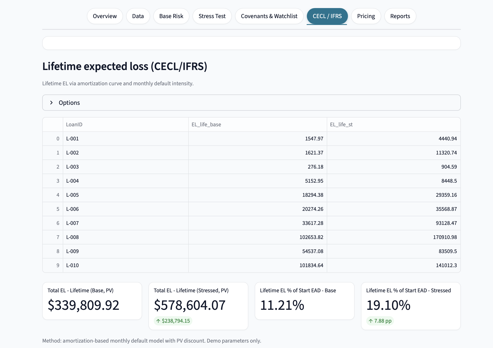

# Credit Risk Intelligence (Streamlit)

[](https://www.python.org/)
[](https://credit-risk-intel-auro.streamlit.app)
[](#license)
[](#)

**Live demo:** [https://credit-risk-intel-auro.streamlit.app](https://credit-risk-intel-auro.streamlit.app)
**Repo:** [https://github.com/Aurokrishnaa/credit-risk-intelligence-Auro](https://github.com/Aurokrishnaa/credit-risk-intelligence-Auro)

> Stress, assess, and price credit portfolios with explainable PD/LGD/EAD analytics, CECL/IFRS lifetime loss, covenant headroom, and a print-ready executive report—built in Python/Streamlit by **Aurokrishnaa R L (MS Finance—Quant · MBA Finance)**.

---

## Table of contents

* [Highlights](#highlights)
* [What’s inside (end-to-end flow)](#whats-inside-end-to-end-flow)
* [Screenshots](#screenshots)
* [Quickstart](#quickstart)
* [Usage guide](#usage-guide)
* [Data schema](#data-schema)
* [Modeling details](#modeling-details)
* [Risk tiers & stress design](#risk-tiers--stress-design)
* [Covenants & watchlist](#covenants--watchlist)
* [CECL / IFRS](#cecl--ifrs)
* [Risk-based pricing](#risk-based-pricing)
* [Report Mode (print/PDF)](#report-mode-printpdf)
* [Performance & limits](#performance--limits)
* [Project structure](#project-structure)
* [Troubleshooting](#troubleshooting)
* [Roadmap](#roadmap)
* [License](#license)
* [Author & contact](#author--contact)

---

## Highlights

* **Robust data ingestion**: CSV template (download in-app), tolerant encoding/sep loader (UTF-8/UTF-8-SIG/Latin-1; comma/semicolon) and clean rate parsing.
* **Core risk stack**: PD / LGD / EAD / EL at loan level with transparent heuristics and safeguards.
* **Macro stress testing**: rate (bps), unemployment (pp), and collateral shocks flow through cashflow metrics → PD/LGD/EAD/EL.
* **Covenants & watchlist**: DSCR, ICR, LTV, DTI headroom with Green/Amber/Red badges and a downloadable exceptions file.
* **CECL/IFRS lifetime EL**: amortization curve + monthly default hazard + PV discount.
* **Risk-based pricing**: EL% + (capital + opex + profit) → suggested spread (bps) and all-in rate.
* **Executive reporting**: polished **Report Mode** with snapshot locking, PII masking, charts, and print/PDF styles.
* **Tech**: Streamlit · pandas · NumPy · numpy-financial · Matplotlib.
* **App version**: `v1.3.0`.

---

## What’s inside (end-to-end flow)

**Data → Base risk → Stress → CECL → Covenants → Pricing → Report**

1. **Ingest & validate**: upload CSV or click **Use sample dataset**.
2. **Derive cashflows & ratios**: payment, balance @ 12m, interest Y1, LTV/DTI/DSCR/ICR.
3. **Estimate base risk**: PD (scorecard), LGD (collateral haircuts), EAD (12m avg), EL.
4. **Apply stress**: rate/unemp/collateral shocks propagate; PD/LGD/EAD/EL recomputed.
5. **Tier & concentrate**: PD-percentile tiers (Low/Med/High); top sectors/geos by EAD.
6. **Covenants**: compute headroom, badge (R/A/G), watchlist & export.
7. **CECL/IFRS**: lifetime EL (PV) using monthly default intensity over amortization.
8. **Pricing**: translate risk into suggested spread (bps) and all-in rate.
9. **Report Mode**: one-click print/PDF with KPI deltas, composition, watchlist, and pricing insights.

---

## Screenshots





---

## Quickstart

### 1) Run the live app (no setup)

* **[https://credit-risk-intel-auro.streamlit.app](https://credit-risk-intel-auro.streamlit.app)**

### 2) Run locally

```bash
# clone
git clone https://github.com/Aurokrishnaa/credit-risk-intelligence-Auro.git
cd credit-risk-intelligence-Auro

# (optional) create a venv
python3.12 -m venv .venv
# mac/linux
source .venv/bin/activate
# windows (powershell)
# .venv\Scripts\Activate.ps1

# install
python -m pip install -U pip
pip install -r requirements.txt

# run
streamlit run app.py
```

**Requirements**

* Python **3.12**
* `streamlit`, `pandas`, `numpy`, `numpy-financial`, `matplotlib` (pinned in `requirements.txt`)

---

## Usage guide

1. **Get started**

   * Click **Download CSV template**, replace sample rows, keep the same headers.
   * Or click **Use sample dataset** to explore features instantly.
   * Upload your CSV (≤ **200 MB**).

2. **Scenario & filters**

   * Sidebar: choose **Base / Adverse / Severe / Custom** (rate bps, unemployment pp, collateral drop %).
   * Global filters: **Sector**, **Geography**, and **Risk tier (stressed)**.

3. **Explore tabs**

   * **Overview**: KPIs (EAD / w-avg PD / EL / High-risk%) and key charts.
   * **Data**: first rows + derived metrics; validation issues (if any).
   * **Base Risk**: loan-level PD/LGD/EAD/EL and PD-tiering.
   * **Stress Test**: shocked PD/LGD/EAD/EL and tier mix.
   * **Covenants & Watchlist**: DSCR/ICR/LTV/DTI headroom, badges, exceptions CSV.
   * **CECL / IFRS**: lifetime EL (PV) with discount rate.
   * **Pricing**: suggested spread (bps) & all-in rate; export pricing table (CSV).
   * **Reports**: **Report Mode** → **Print / Save as PDF** (browser dialog).

4. **Notes**

   * **InterestRate is numeric**. For 7.5%, use `0.075` or `7.5` (no `%` sign).
   * Minimal required columns: `LoanAmount`, `InterestRate`, `TermMonths`.

---

## Data schema

**Minimal required**

* `LoanAmount` *(USD)*
* `InterestRate` *(decimal or percent numeric; e.g., `0.075` or `7.5` for 7.5%)*
* `TermMonths` *(>0)*

**Recommended (for richer analytics)**

* `LoanID`, `Borrower`, `Sector`, `Geography`
* `CreditScore` *(300–850)*
* `MonthlyIncome`, `NOI`, `EBITDA`
* `CollateralType`, `CollateralValue`, `CurrentMarketValue`
* `ExistingDTI`

The app auto-selects **CurrentMarketValue** (if valid) else **CollateralValue** as `CollateralBase`.

**Validation checks**

* Positive `LoanAmount` / `TermMonths`, valid numeric `InterestRate`
* `CreditScore` in \[300, 850] (if provided)
* Collateral presence/positivity
* Rows with issues appear in **Data → Rows with data issues**

---

## Modeling details

### Cashflow & ratios

* **Monthly payment** `A = pmt(r/12, n, -P)` with zero-rate guard.
* **Outstanding balance @ 12m**: amortization formula with edge-case handling.
* **First-year interest**: month-by-month loop.
* **Ratios**:

  * `LTV = LoanAmount / CollateralBase`
  * `DTI = MonthlyPayment / MonthlyIncome`
  * `DSCR = NOI / AnnualDebtService` *(or `MonthlyIncome×12 / AnnualDebtService` as fallback)*
  * `ICR = EBITDA / Interest_Y1`

### PD (12-month) — scorecard heuristic

* **Base by CreditScore** bands (prime → subprime), then multiplicative factors:

  * **DTI** buckets (↑ leverage → ↑ PD)
  * **LTV** buckets (↑ leverage → ↑ PD)
  * **Sector** factor (e.g., hospitality/retail > manufacturing/healthcare)
* Clamped to `[0.2%, 35%]`.

### LGD — collateral haircuts

* **Haircuts** by `CollateralType` (e.g., real estate 30%, equipment 45%, inventory/AR 60%, securities 10%).
* Recovery cost (10%) then `LGD = 1 − min(effective collateral / LoanAmount, 1)×(1 − recovery_cost)`; clamp `[5%, 95%]`.

### EAD (12m)

* `EAD_12m = 0.5 × (LoanAmount + Balance@12m)`.

### EL (12m)

* `EL_12m = PD_12m × LGD × EAD_12m`.

---

## Risk tiers & stress design

### Tiers (explainable)

* **Percentile-based** on **base PD** (≈33/66 cuts) with a stable fallback when samples are small.
* Stressed tiers reuse base PD cutpoints for comparability.

### Stress scenario mechanics

* **Rate shock (bps)** → raises payment/DSCR/DTI → feeds PD & balances.
* **Unemployment shock (pp)** → multiplicative PD uplift `min(1 + 0.10×pp, 2.5)`.
* **Collateral drop (%)** → lower `CollateralBase` → higher LTV → feeds LGD/PD.
* All recalculated metrics (PD/LGD/EAD/EL) are shown under **Stress Test**.

---

## Covenants & watchlist

* Headroom under stress:

  * `HR_DSCR = DSCR_st − DSCR_min`
  * `HR_ICR = ICR_st − ICR_min`
  * `HR_LTV = LTV_max − LTV_st`
  * `HR_DTI = DTI_max − DTI_st`
* **Badges**: **Red** (breach), **Amber** (near), **Green** (healthy) using user thresholds + amber buffers.
* **Watchlist**: Red/Amber sorted by **WorstHeadroom**; **Download Exceptions (CSV)**.

---

## CECL / IFRS

* **Monthly default probability** from 12-month PD:
  `p_m = 1 − (1 − PD_12m)^(1/12)`.
* **Lifetime EL (PV)** loops over months:

  * survival × `p_m` gives default mass each month
  * `EAD_t` is outstanding balance
  * `EL_t = survival × p_m × LGD × EAD_t`
  * discount by `(1 + r/12)^t` (user-set **discount rate**)
* Reported as totals and as `% of start EAD` for **Base** and **Stressed**.

---

## Risk-based pricing

* **EL rate (stressed)**: `EL_12m_st / EAD_12m_st`.
* **Suggested spread**: `EL% + (capital buffer + opex + target profit)`.
* **All-in rate**: `funding cost + spread`.
* Portfolio-level metrics + downloadable pricing table (CSV).

---

## Report Mode (print/PDF)

* **Snapshot lock** to freeze metrics and charts for printing.
* **Mask sensitive IDs** (LoanID/Borrower) toggle for sharing.
* **Detailed View** explains methods and stack inline.
* Browser print dialog → **Print / Save as PDF** (letter/A4, default/narrow margins, hide headers/footers).

---

## Performance & limits

* **Upload limit:** 200 MB (CSV).
* **Caching:** heavy calcs wrapped with `@st.cache_data` (payments, balances, lifetime EL).
* **Matplotlib** runs on the `Agg` backend for reliable image generation.

---

## Project structure

```
credit-risk-intelligence-Auro/
├─ .streamlit/              # Streamlit config/theme
├─ data/                    # Template/sample CSVs (written by the app)
├─ app.py                   # Main Streamlit application
├─ requirements.txt         # Python dependencies
├─ LICENSE                  # MIT
└─ Assets/                  # Screenshots of the app
```

> The app may create `reports/` at runtime for convenience; it is **not required** to be committed.

---

## Troubleshooting

* **“Unsupported or unreadable CSV”** → export as **UTF-8, comma-delimited**; start from the in-app template.
* **“Required columns missing”** → ensure headers match **exactly**. Minimal: `LoanAmount`, `InterestRate`, `TermMonths`.
* **Interest rate parsing** → use `0.075` **or** `7.5` for 7.5% (no `%`).
* **Empty view after filters** → set Sector/Geography/Tier back to **All** (the app auto-relaxes the tightest filter and warns).

---

## Roadmap

* Odds/Logit PD option with simple calibration helper
* Multi-period EAD (amortizing/utilization profiles)
* Scenario manager (save & compare)
* CSV schema lint with column type hints

---

## License

This project is licensed under the **MIT License**. See [`LICENSE`](./LICENSE).

---

## Author & contact

**Aurokrishnaa R L** — *MS Finance (Quant) · MBA Finance*

* **Website:** [https://www.aurokrishnaa.me](https://www.aurokrishnaa.me)
* **LinkedIn:** [https://www.linkedin.com/in/aurokrishnaa](https://www.linkedin.com/in/aurokrishnaa)

> *Models are demo-calibrated for illustration only and are not a production credit policy or financial advice.*
